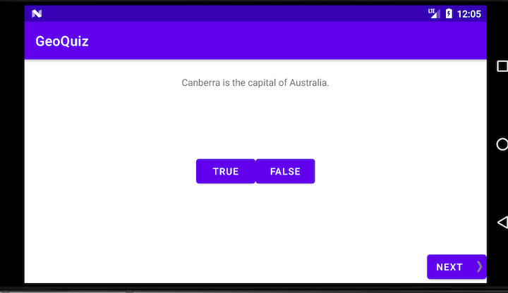
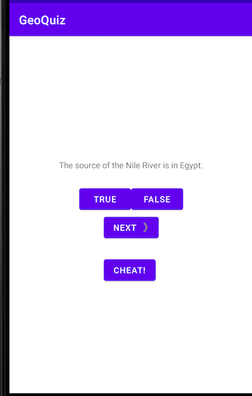
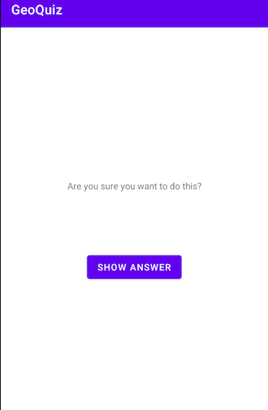
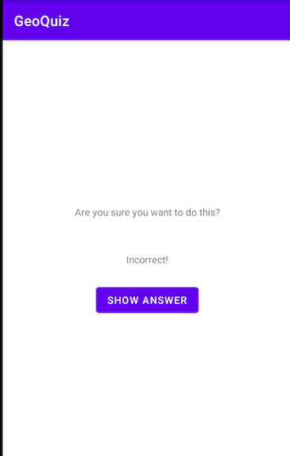
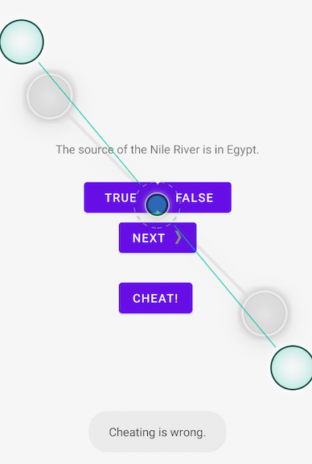

# GeoQuiz
A simple true/false quiz

## 1: Your first applicaton

### Create a new project

### Laying out the UI
* recreate this [example](01-1.png)

### Wiring up Widgets
* Wired up the UI you created previously
* Clicking on the true/false button show display a toast

### Challenges
all challenges are on a seperate branch
* display toast on top of the screen instead of the bottom


## 2: Android and MVC
* use a data class to store your questions
* add a next button
* remove hard coded question, all questions are assigned programmatically
* on click, cycle through the next question
* the questions:
```
<string name="question_australia">Canberra is the capital of Australia.</string>
<string name="question_oceans">The Pacific Ocean is larger than
  the Atlantic Ocean.</string>
<string name="question_mideast">The Suez Canal connects the Red Sea
  and the Indian Ocean.</string>
<string name="question_africa">The source of the Nile River is in Egypt.</string>
<string name="question_americas">The Amazon River is the longest river
  in the Americas.</string>
<string name="question_asia">Lake Baikal is the world\'s oldest and deepest
  freshwater lake.</string>
```
* the answers:
```
Question(R.string.question_australia, true),
Question(R.string.question_oceans, true),
Question(R.string.question_mideast, false),
Question(R.string.question_africa, false),
Question(R.string.question_americas, true),
Question(R.string.question_asia, true))

```
* display a toast, indicating if the answer is correct or not
* get a right arrow for your "next" button from
    * [http://www.bignerdranch.com/solutions/AndroidProgramming4e.zip](http://www.bignerdranch.com/solutions/AndroidProgramming4e.zip)

### Challenges
challenges are on a seperate branch
* clicking on the text should navigate to the next question
* add a previous button
* change the next/prev button to a image button, no text


## 3: The Activity Lifecycle
* log the activity lifecycles
* create a landscape layout of activity_main


### Challenges
challenges are on a seperate branch
* prevent repeated answers
* grade quiz on complete

## 4: Persisting UI State
* add dependency to use ViewModel
    * `` androidx.lifecycle:lifecycle-extensions:2.0.0 ``
* persisting data through configuation with ViewModel
    * create a QuizViewModel
        * log its lifeCycles
    * add QuizViewModel to MainActivity
        * log it
    * observe the logs on rotation of app
    * migrate Quiz logic to QuizViewModel
* persisting data through process death with save instance state
    * ensure that this work by turning on "don't keep activities"
    * hit the home button, reopen the app through your list.
        * the data should persist


## 6: Your Second Activity
* create a new activity using the activity wizard
    * CheatActivity
* layout the activity_cheat layout
    * text field for the warning
    * text field for the answer
    * a cheat button
* add the cheat button to main activity
    * don't forgt about the land-scape layout!
    * start cheatActivity on Click
    * clicking on the cheat button will start the cheat activity
* cheat activity
    * wire up the necessary widgets
    * impl a show answer button
* cheat activity commuicate with the main activity if the uesr cheats
    * shame the user for cheating

### Examples





### Challenges
challenges are on a seperate branch
* cheater can still cheat if they rotate the add. fix this!
* only shame the user for the question they cheated on
